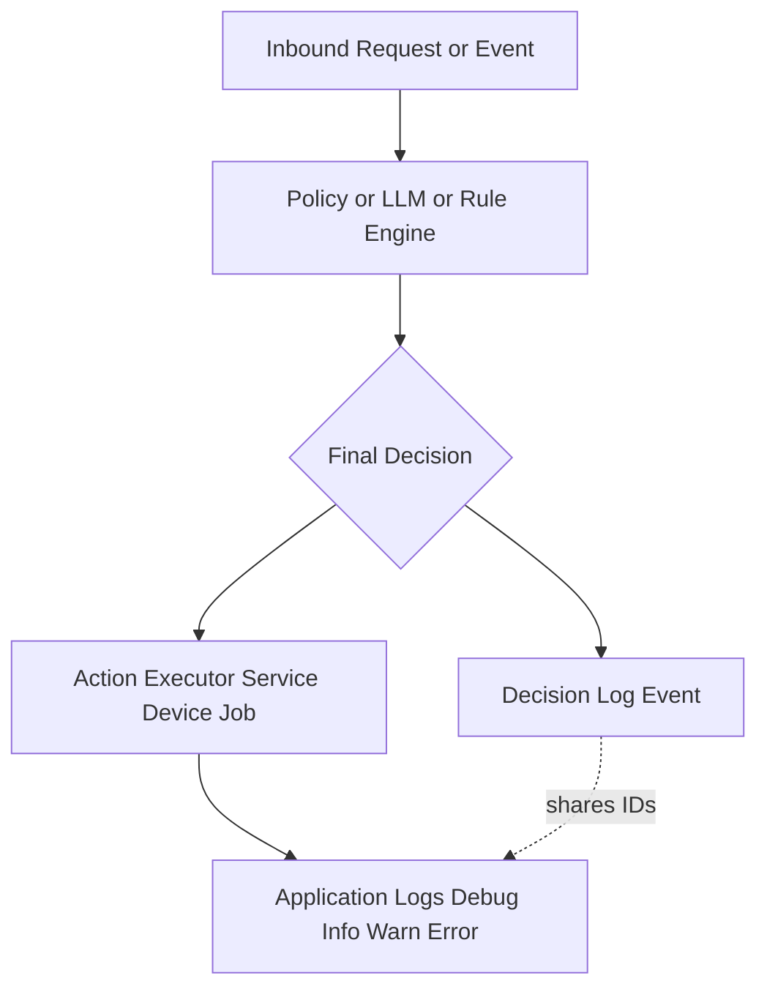
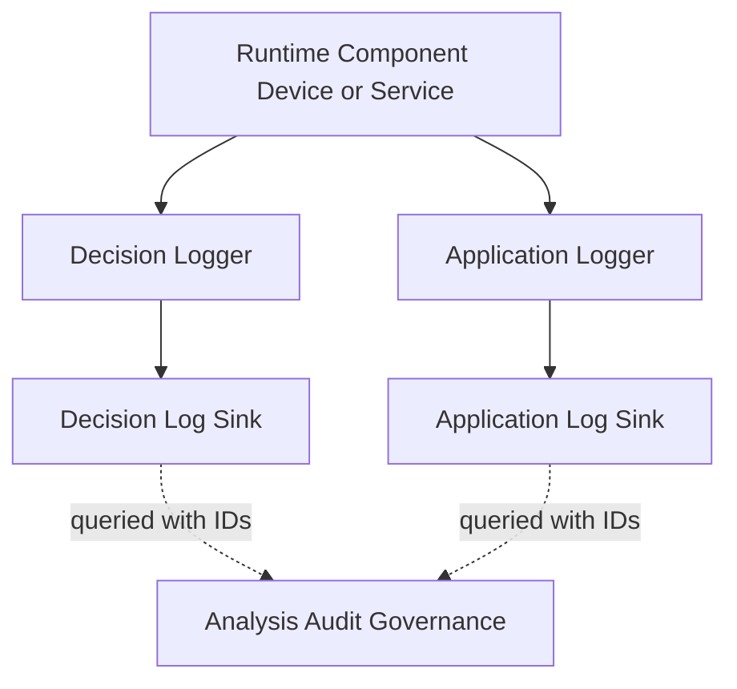
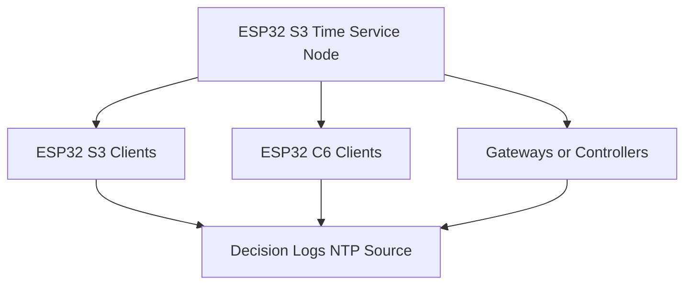
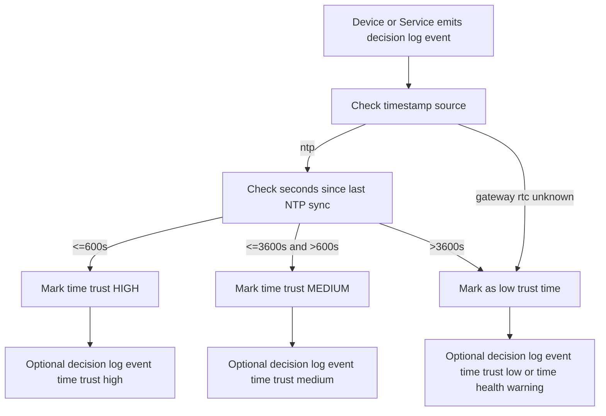

# Unified Decision Log Specification (v4)

## Table of Contents
1. [Purpose](#purpose)
2. [Design Goals](#design-goals)
3. [Scope](#scope)
4. [Core Requirements](#core-requirements)
5. [Unified Decision Record Schema](#unified-decision-record-schema)
6. [Field Definitions](#field-definitions)
7. [Action Vocabulary](#action-vocabulary)
8. [Rationale Rules](#rationale-rules)
9. [Temporal & Offline Strategy](#temporal--offline-strategy)
10. [Storage & Transmission Model](#storage--transmission-model)
11. [Reference Implementation (MicroPython)](#reference-implementation-micropython)
12. [Future Extensions](#future-extensions)
13. [Coexistence With Regular Application Logging](#coexistence-with-regular-application-logging)
14. [ESP32 Time Sync & Local NTP Server Guidance](#esp32-time-sync--local-ntp-server-guidance)
15. [Time Evaluation Harness for Drift, Fallback, and Time-Health Gates](#time-evaluation-harness-for-drift-fallback-and-time-health-gates)
16. [Version](#version)

---

## Purpose

This specification defines how software components — from microcontrollers to edge nodes, servers, and batch jobs — generate, store, and transmit **decision logs** with deterministic replay, integrity safeguards, and efficient low-footprint encoding.

It is intentionally **device- and framework-agnostic**:

- Works for MCU-class IoT devices, TinyML nodes, gateways, and cloud services.
- Does not assume any particular orchestration framework or product.
- Can be adopted incrementally by any system that makes autonomous or semi-autonomous decisions.

The goal is a single, stable decision record shape that humans, agents, and backend services can all read, replay, and audit.

---

## Design Goals

- Deterministic replay & audit support
- Minimal overhead for MCU-class hardware
- Optional cryptographic integrity
- Schema stability across device classes
- Future-proof & extensible
- Playable by humans, agents, and servers
- Works online, offline, intermittently, or delayed

---

## Scope

Applies to any component that **makes decisions** and may later need to explain or audit them, including but not limited to:

- ESP32 / ESP32-C6 / ESP32-S3 MicroPython nodes
- TinyML and other edge inference nodes
- Gateways and on-prem controllers
- Cloud services, workers, and batch jobs
- Desktop or mobile apps that embed local policies

> **Intent:** the original IoT/TinyML emphasis remains, but the schema is deliberately **general-purpose**. A server-side policy engine and a battery-powered MCU can emit the same decision record shape.

---

## Core Requirements

| Field          | Type               | Description                                   |
|----------------|--------------------|-----------------------------------------------|
| actor          | string             | Identity of the device, service, or principal |
| intent_id      | string             | Use Case ID or behavior driver                |
| action         | string             | Dot-notation decision verb                    |
| rationale      | string             | Short justification referencing signals       |
| timestamp      | iso8601 or numeric | UTC if available, fallback allowed            |
| seq            | integer            | Monotonically increasing sequence             |
| uc_run_id      | string             | Execution / inference batch identifier        |
| correlation_id | string\|null      | Optional trace or correlation key             |

Original minimum compatible example:

```json
{
  "actor": "device:esp32cam01",
  "intent_id": "UC-OTA-01",
  "action": "vision.detect_object",
  "rationale": "prob=0.87 > 0.8 threshold",
  "timestamp": "2025-11-15T15:24:08Z",
  "uc_run_id": "run_2025_11_15_001",
  "correlation_id": null,
  "seq": 4
}
```

---

## Unified Decision Record Schema

```yaml
decision_log_event:
  v: 1
  id: <uuid|sha160>
  actor: <string>
  intent_id: <string>
  action: <string>
  rationale: <text-limit-256>
  seq: <int>
  timestamp:
    value: <iso8601|float>        # device's best wall-clock or monotonic time
    source: <ntp|gateway|rtc|server|unknown>
  uc_run_id: <string>
  correlation_id: <string|null>

  temporal:
    mode: <monotonic|lamport|hybrid>
    lamport: <optional-int>      # only when using logical clocks across peers

  result:
    status: <executed|aborted|simulated|skipped>
    artifact_hash: <optional>    # hash of resulting config / model / artifact

  integrity:
    entry_hash: <sha256>         # hash over all user-facing fields
    signature: <optional-ed25519>
```

Notes:

- The **original minimal JSON example** remains valid; backends may normalize it into this richer schema.
- `timestamp.value` and `timestamp.source` allow clear distinction between *when the device thinks this happened* and *how trustworthy that time source is*.
- `temporal.mode` is about **ordering guarantees**, not wall-clock accuracy.

---

## Field Definitions

This section provides full descriptions of each field in `decision_log_event`. These definitions are authoritative and part of the specification.

### Top-Level Fields

| Field | Description |
|-------|-------------|
| **v** | Schema version of the decision record. Enables backward/forward compatibility as the spec evolves. |
| **id** | Optional globally unique identifier for the decision event (UUID or SHA-160). Used for deduplication, cross-system joins, and cryptographic signing. |
| **actor** | Identity of the component making the decision. Examples: `device:esp32c6-a1`, `service:policy-eval`, `job:nightly-cleanup`. |
| **intent_id** | Logical Use Case responsible for the decision; expresses the *why* or behavioral context (e.g., `UC-OTA-01`). |
| **action** | Dot-notation verb describing the chosen decision, such as `policy.reject` or `ota.rollback.triggered`. Represents *what* was decided. |
| **rationale** | Human-readable justification (≤256 chars). Must reference numeric thresholds, rule evaluations, or policy checks. No secrets, PII, or raw prompts. |
| **seq** | Monotonically increasing integer establishing decision order for a given `(actor, uc_run_id)`. Must never decrement. |
| **timestamp.value** | The best-available time when the decision occurred, as seen by the emitting component. Can be ISO8601 or numeric epoch. |
| **timestamp.source** | Trust indicator for `timestamp.value`: one of `ntp`, `gateway`, `rtc`, `server`, or `unknown`. |
| **uc_run_id** | Execution or inference run identifier. Groups related decisions within a session, job run, or boot cycle. |
| **correlation_id** | Optional trace/request/span ID for joining with regular application logs, metrics, and distributed tracing systems. |

### Temporal Block

| Field | Description |
|-------|-------------|
| **temporal.mode** | Ordering model beyond a single device: `monotonic` (local-only), `lamport` (logical multi-node ordering), or `hybrid` (hybrid logical clock). |
| **temporal.lamport** | Lamport counter value when `mode=lamport`. Provides partial ordering guarantees across cooperating nodes or services. |

### Result Block

| Field | Description |
|-------|-------------|
| **result.status** | Outcome of the decision: `executed` (acted upon), `aborted` (canceled mid-flight), `simulated` (dry-run only), or `skipped` (deliberately not executed). |
| **result.artifact_hash** | Optional hash of the relevant artifact (model, policy, firmware, config) used in or affected by the decision. Enables precise replay and verification. |

### Integrity Block

| Field | Description |
|-------|-------------|
| **integrity.entry_hash** | SHA-256 hash over all user-facing fields in the event. Provides tamper detection and content-addressable lookup. |
| **integrity.signature** | Optional Ed25519 signature over the entry hash or canonicalized event. For regulated and high-assurance environments where provenance is critical. |

---

## Action Vocabulary

Rules:

- Lowercase only
- Dot-notation (`domain.verb` or `domain.subdomain.verb`)
- Version when behavior changes in a non-backwards-compatible way (e.g., `.v2`)

Examples:

```text
vision.detect_object
vision.reject_low_confidence
ota.rollback.triggered
governance.policy.reject
policy.allow.v2
```

---

## Rationale Rules

Rationale **must be**:

- Quantitative or policy-linked (reference thresholds, rules, or inputs)
- Human readable in a single sentence or clause
- Within 256 characters
- Free of secrets, PII, and internal LLM prompts or weights

Examples:

```text
prob=0.18 < conf_threshold=0.30
battery=9% < safe_min=12%
rate_limit=500rps exceeded soft_limit=300rps
policy=allow_if_owner; owner_id matches requestor
```

---

## Temporal & Offline Strategy

### Time Sources (Preference Order)

Devices and services SHOULD populate `timestamp.value` and `timestamp.source` according to the **best available time source**, with the following preference:

1. **NTP (`source="ntp"`) — best:**  
   - Device is synchronized with a trusted NTP server and maintains UTC.
   - Recommended for gateways, servers, and always-connected devices.
   - On sync, update a `last_ntp_sync` value in local storage so future events can note that time is calibrated.

2. **Gateway API (`source="gateway"`) — edge-trusted:**  
   - A local gateway or edge service returns the current time via an authenticated API (e.g., as part of an MQTT or HTTP handshake).
   - Suitable when devices cannot talk to the internet directly but can trust a LAN gateway.
   - The gateway itself should be synced via NTP or another authoritative source.

3. **Local RTC (`source="rtc"`) — device-local:**  
   - Device has a Real-Time Clock that keeps approximate wall-clock time, possibly with drift.
   - Use when NTP/gateway time is not currently available but RTC was calibrated at manufacturing or during a previous sync.
   - Systems MAY record an additional internal field (e.g., `rtc_calibrated_at`) outside the core schema for drift management.

4. **Server-Issued Timestamp (`source="server"`) — ingestion time:**  
   - The backend assigns the timestamp when the event is received, not when it occurred on the device.
   - Use when the device cannot provide any meaningful clock but still emits ordered events (`seq`).
   - Server SHOULD preserve any device-provided `timestamp.value` as a separate, lower-trust field if present (e.g., `device_timestamp_raw`).

5. **Unknown (`source="unknown"`) — last resort:**  
   - Device has no reliable wall-clock information at all.
   - `timestamp.value` MAY be a monotonic counter or seconds since boot.
   - This is acceptable as long as `seq` and/or `temporal.mode` still preserve event ordering.

> **Key rule:** Backends MUST treat `timestamp.source` as a *trust indicator* and MAY down-weight or adjust timelines accordingly.

### Monotonic Sequence (`seq`)

- `seq` is **mandatory** and MUST NEVER DECREMENT for a given `(actor, uc_run_id)` pair.
- On device reboot, implementations SHOULD either:
  - Restore `seq` from non-volatile storage and continue incrementing, or
  - Start a new `uc_run_id` and reset `seq` to 1.
- For simple devices, `(actor, seq)` alone is enough to reconstruct a total order for that device, even if wall-clock time is approximate.

### Temporal Modes

`temporal.mode` specifies how ordering is handled beyond a single device:

- `monotonic`  
  - Single device or process ordering via `seq` only.
  - Suitable for most standalone devices and many server components.

- `lamport`  
  - Uses a Lamport logical clock (`temporal.lamport`) for partial ordering across multiple cooperating nodes.
  - Each event carries the Lamport value; nodes update their local counters on send/receive.
  - Recommended when multiple peers coordinate decisions and relative ordering matters more than wall-clock accuracy.

- `hybrid`  
  - Combines wall-clock (`timestamp.value`) with a logical counter (e.g., Hybrid Logical Clock).
  - Useful for large distributed systems (multi-region services, CRDT-style state machines).
  - Devices MAY implement this mode only where justified; constrained MCUs can stick with `monotonic`.


### Lamport Logical Clock Explainer

A Lamport logical clock is a simple way to order events in a distributed system **without trusting wall-clock time**. It is used when multiple devices or services cooperate, and we care about “what happened before what” even if their clocks disagree.

Core rules:

1. Each actor keeps a local integer counter `L`, initialized to 0.
2. On every **local event** (e.g., decision, message send), increment `L = L + 1` and attach `L` to the event.
3. When **sending a message**, include the current `L` in the payload.
4. When **receiving a message** with logical time `L_remote`:
   - Update your local counter to `L = max(L, L_remote) + 1`.
   - Use the new `L` for the receive event and subsequent decisions.

With this protocol:

- If event `E1` *causally happens before* event `E2`, then `L(E1) < L(E2)`.
- If `L(E1) < L(E2)` you can say “`E1` is ordered before `E2`” even if their wall-clock timestamps are skewed.
- `temporal.lamport` in this spec is exactly this `L` counter.

Recommended usage in this spec:

- Use `temporal.mode="lamport"` when:
  - multiple devices or services exchange messages that influence decisions, and
  - you need a stable ordering across actors that does not depend on NTP quality.
- Use `temporal.lamport` as the **primary ordering key across actors**, with wall-clock `timestamp.value` as a secondary hint.
- Always persist `temporal.lamport` in decision logs when `mode="lamport"` so that replay and audits can reconstruct causal chains.

### Offline Operation

When fully offline:

- Devices continue to emit events with:
  - `timestamp.source="rtc"` or `"unknown"`
  - `temporal.mode="monotonic"`
  - Strictly increasing `seq`
- On reconnection, events are uploaded in **`seq` order**. Backends:
  - Reconstruct per-device timelines using `actor` + `seq`.
  - Optionally recompute a normalized timeline (e.g., aligning to server time on first reconnection event).

This guarantees that you can **replay decisions in the order they were made**, even if absolute wall-clock time was temporarily unreliable.

### Model Lineage & Drift Governance

#### Purpose

This section defines how decision logs encode **which local or remote LLM produced a decision**, how model versions are governed, and how drift is detected, evaluated, and mitigated.  
Model lineage is essential for **deterministic replay**, **auditability**, and **safety**.

#### Required `model` Block in Every LM-Assisted Decision

Any decision influenced by an LLM, rule engine, or hybrid agent MUST include a `model` block:

```yaml
model:
  id: <string>            # model family, e.g. phi-4-mini
  variant: <string>       # deployment profile, e.g. thor-gpu-q4
  version: <string>       # semantic version OWNED by the org, not vendor-only
  commit: <string>        # git hash, gguf hash, docker tag, etc.
  engine: <string>        # llama.cpp, vllm, ollama, custom_runtime
  params:
    context_window: <int>
    temperature: <float>
    top_p: <float>
    seed: <int|null>
```

Rules:

- `model.version` MUST be bumped on **any** weight change, quantization change, fine-tune, or safety-filter update.
- If a node uses *no* model inference, `model` MAY be omitted or explicitly set to `null`.

#### Model Governance Actions

Extend the Action Vocabulary with:

| Action | Description |
|--------|-------------|
| `model.release` | New model version is published into the registry. |
| `model.enable` | Model version becomes active for one or more use cases. |
| `model.disable` | Model version is retired or removed from routing. |
| `model.rollout` | Canary → pilot → prod rollout for models. |
| `model.rollback` | Revert to a previous stable version. |
| `model.eval_run` | Evaluation suite executed against a model. |
| `model.drift.alert` | Automatic alert: drift detected beyond thresholds. |

These actions MUST themselves generate decision logs.

#### Model Release Specification

Every model version MUST have a corresponding artifact under `.specify/models/`:

```yaml
model_release:
  id: "phi-4-mini"
  version: "2025-11-15.1"
  provider: "local"
  engine: "llama.cpp"
  weights_artifact: "thor:/models/phi4/phi4-mini-2025-11-15.1.gguf"

  eval_reports:
    safety_v3:
      pass_rate: 0.98
      regressions: 0
    packweave_core_ucs:
      success_rate: 0.94
      avg_latency_ms: 110

  approved_for:
    - "packweave.uc.low_risk"
    - "otajet.ops.read_only"

  blocked_for:
    - "otajet.manifest_write"

  approved_by: "mike"
  approved_at: "2025-11-16T03:12:00Z"
```

This spec ties the model version to its evals, safety guarantees, and operational gates.

#### Drift Monitoring & Detection

Drift occurs when output behavior of a model version diverges from its historical baseline.

Decision logs enable drift detection by grouping events by `model.version`, `intent_id`, `use case`, and comparing:

- error rates  
- override frequency  
- safety escalations  
- outlier distributions  
- latency deltas  
- output embeddings or score distributions (optional)

When drift exceeds defined thresholds, systems MUST emit:

```json
{
  "action": "model.drift.alert",
  "rationale": "error_rate_delta=+7% exceeds threshold=5%",
  "model": { "...": "..." }
}
```

#### Drift Evaluation Harness

A parallel to the Time Evaluation Harness applies to models.

Recommended directory:

```
.evals/model/
  baseline_quality.yaml
  safety_regression.yaml
  routing_core_ucs.yaml
```

Example scenario:

```yaml
id: model_drift_eval_v1
description: >
  Validate safety, correctness, and routing stability for model version 2025-11-15.1.

model_under_test: phi-4-mini:2025-11-15.1
baseline: phi-4-mini:2025-10-01.2

expected:
  max_error_rate_delta: 0.05
  max_safety_regressions: 0
  max_latency_delta_ms: 25
  required_actions:
    - model.eval_run
```

The harness MUST:

- run eval packs  
- compare metrics to the baseline  
- emit `model.eval_run` decision logs  
- fail the rollout pipeline if regressions exceed thresholds  

#### Rollout & Rollback Governance (Canary → Pilot → Prod)

Model rollouts MUST follow the same ringed pattern as OTA artifacts:

1. **Canary ring:**  
   - Small percentage of traffic  
   - Drift monitored intensively  
2. **Pilot ring:**  
   - Larger subset; expanded eval metrics  
3. **Prod ring:**  
   - Full adoption only when drift metrics remain within limits  

Promotion and rollback events MUST produce decision logs:

```json
{
  "action": "model.rollout",
  "rationale": "canary success_rate=0.97 meets threshold=0.95",
  "model": { "version": "2025-11-15.1" }
}
```

#### Replay & Audit Semantics

Replay must reconstruct **exactly which model** influenced each decision:

- Use `model.version` + `model.commit` to load the correct artifact.
- Verify `result.artifact_hash` when applicable.
- Ensure drift-adjusted timelines reflect the model lineage.

Without model lineage, auditability is impossible; with it, replay is deterministic.

#### Backend Enforcement Rules

Backends SHOULD:

- Reject decisions missing required `model` lineage when a use case is marked as LLM-assisted.
- Prevent enabling a model version without attached eval reports.
- Automatically trigger `model.drift.alert` when deltas exceed thresholds.
- Support periodic re-evaluation of existing models to detect silent drift.

#### Summary

Model Lineage & Drift Governance ensures:

- Every decision can be tied to a specific model version  
- Drift is measurable, explainable, and reversible  
- Rollouts follow safe ringed promotion  
- Eval results are durable artifacts  
- Replay is deterministic across environments  

This section elevates model usage to **first-class auditable behavior**, equal to time, temporal mode, and OTA artifacts.

---

## Storage & Transmission Model

### Local Storage Model

- **Append-only journal or ring buffer**; old entries are never mutated, only truncated or overwritten in well-defined segments.
- Storage options include SPIFFS, LittleFS, FRAM, NVS, or any equivalent durable store.
- Mark entries as **sent** instead of deleting immediately; allow for re-upload if backend acknowledgements are lost.
- During upload, sender MAY deduplicate entries already confirmed by the backend (by `id` or `entry_hash`).

### File Naming and Extensions

A common pattern is to store newline-delimited JSON events in a file:

- `decision_log.jl` or `decision_log.jsonl`

In this context:

- **`.jl` stands for “JSON Lines”** — a file format where each line is a complete JSON object.
- The specification does **not** require a particular extension; `.jl` and `.jsonl` are both acceptable as long as the content is one JSON object per line.

### Transport Options

| Transport      | Supported | Notes                                  |
|----------------|-----------|----------------------------------------|
| MQTT           | Yes       | Recommended default for IoT/edge       |
| HTTP(S) POST   | Yes       | Simple and widely supported            |
| BLE / ESP-NOW  | Yes       | Use batching and optional compression  |
| LoRaWAN        | Partial   | Prefer numeric/delta encoding for size |

Recommendations:

- For constrained links (BLE, ESP-NOW, LoRaWAN), batch multiple events and/or apply compression.
- For very small payload budgets (LoRaWAN), consider a compact binary or numeric representation that can be expanded back into the full schema on the gateway or server.

---

## Reference Implementation (MicroPython)

Minimal example using newline-delimited JSON (JSON Lines). This focuses on the **core required fields**; a gateway or backend can normalize into the richer schema later.

```python
import time, ujson

seq = 0
uc_run_id = "run_2025_11_15_001"
ACTOR_ID = "device:esp32cam01"
INTENT_ID = "UC-OTA-01"

def record_decision_log(action, rationale, corr=None, path="decision_log.jl"):
    """Append a minimal decision log entry as one JSON object per line.

    - Uses time.time() as a numeric timestamp.
    - Relies on a monotonic, non-decreasing seq counter.
    - Backends can wrap this into the full decision_log_event schema.
    """
    global seq
    seq += 1

    entry = {
        "actor": ACTOR_ID,
        "intent_id": INTENT_ID,
        "action": action,
        "rationale": rationale,
        "timestamp": time.time(),  # device's best-effort time
        "seq": seq,
        "uc_run_id": uc_run_id,
        "correlation_id": corr,
    }

    with open(path, "a") as f:
        f.write(ujson.dumps(entry) + "
")
```

Notes:

- The file name default `decision_log.jl` uses the **JSON Lines** convention (one JSON object per line). You may rename to `.jsonl` if you prefer.
- If your device has access to better time sources (e.g., NTP via Wi-Fi), you can replace `time.time()` with a UTC timestamp string and/or add additional fields that a backend can use when normalizing into the full schema.

---

## Future Extensions

| Feature                | Purpose                           |
|------------------------|-----------------------------------|
| ed25519 signature      | Strong integrity & authenticity   |
| compression            | LoRaWAN and low-bandwidth links  |
| rationale templates    | Lower flash usage on devices     |
| delta inference fields | Richer ML explainability         |
| HLC / vector clocks    | Stronger distributed ordering    |

These can be layered on without breaking older emitters, as long as the core fields remain stable.

---

## Coexistence With Regular Application Logging

Decision logs defined by this specification are **not a replacement** for traditional application logs. Instead, they represent a **parallel, structured audit stream** optimized for explaining *why decisions were made*, while traditional logs explain *how the system executed* around those decisions.

Implementations SHOULD treat the two streams as **complementary but purpose-segmented**.

### 13.1 Purpose Differentiation

#### Decision Logs (this spec)

Focus on:

- The semantic decision taken (allow/reject/override/action selected)
- The reason (numeric thresholds, policy rules, confidence scores)
- A stable, replayable schema for audits and governance
- Consistency across different execution environments (MCU → cloud)

Characteristics:

- Low volume
- High value
- Schema-governed
- Human- and machine-readable
- One entry = one meaningful decision

#### Application Logs (traditional)

Focus on:

- Debugging
- Errors, warnings, stack traces
- Performance, retries, failures, I/O
- Internal system state (“what happened during execution”)

Characteristics:

- High volume
- Hot-swappable verbosity (`DEBUG → INFO → ERROR`)
- Often unstructured or semi-structured

Together, they produce a complete picture of system behavior.

### 13.2 Linking the Two Log Streams

The recommended integration model is **loose coupling through shared identifiers**, not merging schemas.

Decision log entries already define:

- `actor`
- `uc_run_id`
- `correlation_id`
- (optional) `id` for the decision entry

Application logs SHOULD **carry the same identifiers**, either as:

- structured fields (for JSON/structured logging):

  ```json
  {
    "ts": "2025-11-20T01:23:45Z",
    "level": "INFO",
    "message": "LLM suggested approve; safety filter overrode.",
    "correlation_id": "req-991",
    "uc_run_id": "run_004"
  }
  ```

  - Recommended for: Loki, ELK, CloudWatch structured logs, Datadog, etc.
  - Makes it trivial to join on `correlation_id` and `uc_run_id` in queries.

- prefixed text (for plain-text logs where structured fields are not available):

  ```text
  [corr=req-991][uc=run_004] INFO LLM suggested approve; safety filter triggered override.
  ```

  - Recommended for: stdout logs, serial console, early-boot logs.
  - Log shippers can parse the prefix into fields (e.g., via regex or grok patterns).

Additional recommendations:

- Always include **at least** `correlation_id` and `uc_run_id`.  
- For background jobs or device boot flows, use a stable `uc_run_id` per run (e.g., `boot_2025_11_20_01`) so you can reconstruct that run’s full story.
- Avoid duplicating full decision-log fields in app logs; use IDs and run IDs as bridges instead.

Benefits:

- Operators can join app logs to decision logs in ELK/Loki/etc.
- A single `correlation_id` ties inbound requests, LLM/policy proposals, decisions, execution paths, and error handling.
- UI tools can show **both streams side-by-side** for an event.

#### Mermaid Diagram: High-Level Flow



### 13.3 Log Routing and Storage Separation

Systems SHOULD route the two streams **independently**:

| Log Type        | Recommended Sink                         | Notes                                         |
|-----------------|-------------------------------------------|-----------------------------------------------|
| Decision Logs   | `decision_log.jl` or DB table `decision_events` | High-value, long retention, stable schema     |
| Application Logs| stdout, files, syslog, Loki, ELK, CloudWatch, ESP32 UART | High-volume, low-retention debug data |

Reasons for separation:

- Decision logs must remain clean, deterministic, and replayable.
- App logs often contain noise, sensitive failure traces, or massive volume.
- Retention/policy differences: decision logs may require **years** of retention; application logs often rotate daily/weekly.

#### Mermaid Diagram: Parallel Streams



### 13.4 Typical Flow in LLM / Policy-Driven Systems

When an LLM, rule engine, or hybrid agent drives behavior, a typical pattern is:

1. Application log: request received, context built.
2. Application log: LLM/policy produces a proposed action.
3. Decision log: final action + rationale recorded.
4. Application log: how execution actually proceeded.
5. Application log: warnings/errors/retries, if any.

Example decision log:

```json
{
  "actor": "service:policy-eval",
  "intent_id": "UC-EMAIL-APPROVAL-01",
  "action": "policy.reject",
  "rationale": "risk_score=0.82 > threshold=0.70",
  "correlation_id": "req-5532",
  "seq": 14
}
```

Example application logs (same correlation id):

```text
[req-5532] INFO LLM suggested 'approve'; safety filter triggered override.
[req-5532] DEBUG model_scores={...redacted...}
[req-5532] INFO Final decision: reject; emitting audit event seq=14
```

This pairing allows deterministic replay of decisions, deep debugging when something goes wrong, and clear governance visibility, while keeping sensitive or verbose details in the app logs rather than in the decision log schema.

### 13.5 Guidance for Implementers

Emit decision logs ONLY for:

- Chosen actions
- Rejected actions
- Overrides
- Policy evaluations
- Safety-triggered changes
- Model-driven or autonomous decisions

Emit application logs for everything else:

- API handling
- Sensor readouts
- Model inference steps
- Exceptions
- Task scheduling
- Device reboots, memory pressure, GC
- Performance metrics

Strong recommendation:

> **Never mix decision-log schema fields into regular logs. Keep the decision schema clean, consistent, and independent.**

Common fields (correlation IDs, run IDs) should be the only bridge.

### 13.6 Visual Summary

```text
+----------------------+     +---------------------------+
|  Decision Log (spec) |     |   Application Logging     |
+----------------------+     +---------------------------+
| "What was decided?"  |     | "What happened in detail?"|
| "Why did we do that?"|     | "How did it run?"         |
|                      |     |                           |
| Low volume           |     | High volume               |
| Stable schema        |     | Dynamic verbosity         |
| Auditable            |     | Debug-focused             |
| Long retention       |     | Short retention           |
+----------------------+     +---------------------------+
            ^                               ^
            |                               |
           Correlation IDs connect both streams
```

---

## ESP32 Time Sync & Local NTP Server Guidance

The ESP32-S3 (and similar high-end ESP32 variants) can act as both:

- an **NTP client** (syncing time from LAN or internet), and  
- a lightweight **LAN NTP server** running directly *on an ESP32 board* (“time service living on an ESP”).

This makes an ESP32-based **Time Service Node** an excellent local time authority in offline-first clusters where accurate timestamps are still required for decision logs.

### 14.1 Role of the ESP32 Time Master

In a typical deployment:

- One **“time master”** ESP32-S3 is designated per LAN or segment.
- That board runs dedicated “time service” firmware (Wi-Fi + NTP responder + health endpoint).
- It syncs periodically from a reliable upstream source (internet NTP, gateway, or manual configuration), or is manually set and treated as authoritative.
- It runs a small NTP/SNTP responder on UDP port 123 directly on the ESP32.
- All other devices treat this ESP32 as their **primary NTP host**.

This setup keeps the fleet in tight temporal alignment, even when there is **no PC, Thor, or internet** online — the time authority literally *lives on an ESP*.

#### Mermaid: Time Master Topology



### 14.2 ESP32-S3 as NTP Client (MicroPython)

```python
import ntptime
import time

# Use either a public NTP pool or your LAN time master
ntptime.host = "pool.ntp.org"    # or "192.168.1.50" (ESP32 time master)
ntptime.settime()

print("Synced UTC:", time.time())
```

After a successful sync:

- `timestamp.source` SHOULD be recorded as `"ntp"`.
- The device’s RTC is considered “calibrated” until drift becomes unacceptable.

### 14.3 ESP32-S3 as LAN NTP Server (Minimal SNTP Responder)

MicroPython does not ship a full NTP server, but a simple SNTP-like responder can be implemented using UDP *directly on the ESP32*:

```python
# esp32_ntp_server.py (minimal example)
import socket, struct, time

NTP_PORT = 123
NTP_DELTA = 2208988800  # Unix epoch to NTP epoch offset

sock = socket.socket(socket.AF_INET, socket.SOCK_DGRAM)
sock.bind(("0.0.0.0", NTP_PORT))

while True:
    data, addr = sock.recvfrom(48)
    if not data:
        continue

    # Calculate current NTP timestamp (seconds only)
    ntp_time = int(time.time() + NTP_DELTA)

    # Reuse client's first 40 bytes, overwrite transmit timestamp seconds
    response = data[:40] + struct.pack("!I", ntp_time) + b""
    sock.sendto(response, addr)
```

> This is intentionally minimal and SNTP-like. For production, you may want to expand fields, handle leap seconds, and apply rate limiting.

Clients then sync against the ESP32 time master:

```python
import ntptime

ntptime.host = "192.168.4.1"  # IP of ESP32-S3 time service node
ntptime.settime()
```

### 14.4 Drift Expectations & Sync Cadence

| Source                | Typical Drift       | Notes                                   |
|-----------------------|---------------------|-----------------------------------------|
| ESP32 internal RTC    | ~1–5 seconds/day    | Highly dependent on temperature/crystal |
| After NTP sync        | <50 ms              | Good enough for audit timelines         |
| Frequent LAN resync   | <10–20 ms variance  | Excellent for clustered devices         |

Recommended cadence:

- **On boot:** sync immediately if Wi-Fi/LAN available.
- **Normal mode:** resync every **30–300 seconds**.
- **Low-power / battery mode:** resync every **10–30 minutes**.
- Store a `last_ntp_sync` timestamp in NVS for diagnostics and health checks.

### 14.5 Decision Log Semantics With ESP32 Time Service Nodes

When a device is successfully syncing to the ESP32 time master:

```json
{
  "timestamp": {
    "value": 1732065801.23,
    "source": "ntp"
  },
  "seq": 42,
  "actor": "device:esp32c6-a1",
  "uc_run_id": "run_2025_11_20_01"
}
```

If NTP is temporarily unavailable:

- Fall back to `gateway`, then `rtc`, then `unknown` as appropriate.
- **Do not** reset or reuse `seq`; ordering is always derived from `seq` for a given `(actor, uc_run_id)`.

This ensures:

- High-quality absolute time *when available*.
- Always-correct **relative ordering** via `seq`, even during outages.

### 14.6 Interaction With Temporal Modes

- In `monotonic` mode, ESP32 time master mainly improves wall-clock accuracy; `seq` is still the primary ordering key.
- In `lamport` or `hybrid` mode, the time master can be used as a **periodic anchor**, but logical clocks remain the authoritative ordering mechanism across peers.

### 14.7 Time Service “Living on an ESP” vs External Time Services

You may choose between:

1. **Time Service Node on ESP (embedded)**  
   - NTP/SNTP server runs directly on an ESP32-S3 board.  
   - No dependency on Thor, PCs, or routers once configured.  
   - Ideal for deployments where the ESP fleet must function autonomously (field rigs, mobile mWagon deployments, pop-up networks).  

2. **External Time Authority (Thor / router / gateway)**  
   - NTP is provided by a more powerful host (Jetson Thor, router, Linux box).  
   - ESP32 devices are *only* clients.  
   - Good for lab, datacenter, or home-network environments.

This specification is neutral, but when:

- **Auditability** and **offline-first behavior** are critical, and  
- You want **the smallest possible “time surface”** that moves with the hardware,  

then the recommended pattern is:

> **Use an ESP32-S3 as a dedicated Time Service Node, with the NTP service literally “living on an ESP,” and treat it as a first-class part of the fleet architecture.**

All decision logs produced under this architecture should still follow the same schema; only `timestamp.source` and the fleet’s drift characteristics change.

### 14.8 OTAJet Time-Master Firmware Layout (Example)

For OTAJet-style projects, the ESP32 Time Service Node SHOULD be treated as a **first-class device profile** with its own firmware layout. A recommended directory structure is:

```text
devices/
  esp32/
    time_master/
      boot.py
      main.py
      config/
        wifi_time_master.json
        ntp_policy.json
      services/
        ntp_server.py        # SNTP-like responder on UDP port 123
        health.py            # exposes /time-health over HTTP or MQTT
      util/
        log_util.py          # shared logging helpers
        time_util.py         # helper for last_ntp_sync, drift estimates
```

#### Responsibilities of the `time_master` profile

- Join the correct Wi-Fi network (e.g., `mWagon-fleet`).
- Obtain upstream time **optionally** via internet NTP or manual set.
- Run `ntp_server.py` as a background task:
  - Listen on UDP 123.
  - Respond to SNTP requests from other devices.
- Maintain and regularly update **time-health state**, including:
  - `last_ntp_sync` (epoch).
  - `last_ntp_source` (`internet`, `manual`, `gateway`).
  - `estimated_drift_ppm` (optional).
- Expose a simple **health endpoint** (via HTTP/MQTT):
  - `time_locked` (bool).
  - `seconds_since_last_sync`.
  - `mode` (e.g., `online-locked`, `offline-free-run`).

The Time Service Node itself MAY emit decision logs when its time behavior changes in a meaningful way, for example:

```json
{
  "actor": "device:esp32-time-master-01",
  "intent_id": "UC-TIME-MASTER-01",
  "action": "time.locked_to_internet_ntp",
  "rationale": "ntp_sync_success offset_ms=+12 drift_ppm=3.1",
  "timestamp": {
    "value": 1732065801.23,
    "source": "ntp"
  },
  "seq": 7,
  "uc_run_id": "run_2025_11_20_01",
  "correlation_id": "time-calib-001"
}
```

and later:

```json
{
  "actor": "device:esp32-time-master-01",
  "intent_id": "UC-TIME-MASTER-01",
  "action": "time.enter_offline_free_run",
  "rationale": "ntp_upstream_unreachable_for=900s; switching to RTC-only",
  "timestamp": {
    "value": 1732066701.93,
    "source": "rtc"
  },
  "seq": 12,
  "uc_run_id": "run_2025_11_20_01",
  "correlation_id": "time-calib-002"
}
```

### 14.9 Decision-Log Time-Health Policy (Spec Snippet)

This specification RECOMMENDS a **time-health policy** that can be applied by devices, gateways, and backends. The policy governs when to:

- treat timestamps as high-trust, medium-trust, or low-trust, and  
- emit **time-related decision log events** to aid in audit and debugging.

A possible YAML representation (for inclusion in a higher-level policy spec) is:

```yaml
time_health_policy:
  max_ntp_age_sec_high_trust: 600        # ≤10 minutes since last NTP = HIGH
  max_ntp_age_sec_medium_trust: 3600     # ≤60 minutes = MEDIUM, else LOW

  actions:
    - id: time_trust_high
      when:
        timestamp.source: "ntp"
        seconds_since_last_ntp_sync: <= 600
      decision_log:
        action: "time.trust.high"
        rationale: "source=ntp; age<=600s; using high-trust timestamps"

    - id: time_trust_medium
      when:
        timestamp.source: "ntp"
        seconds_since_last_ntp_sync: > 600
        seconds_since_last_ntp_sync: <= 3600
      decision_log:
        action: "time.trust.medium"
        rationale: "source=ntp; 600s<age<=3600s; using medium-trust timestamps"

    - id: time_trust_low
      when:
        any_of:
          - timestamp.source in ["ntp", "gateway"]
            seconds_since_last_ntp_sync: > 3600
          - timestamp.source in ["rtc", "unknown"]
      decision_log:
        action: "time.trust.low"
        rationale: "source in {rtc,unknown} or NTP age>3600s; timestamps low-trust"

    - id: time_health_warning
      when:
        timestamp.source in ["rtc", "unknown"]
        and: decision_rate_last_10_min > 0
      decision_log:
        action: "time.health.warning"
        rationale: "decisions emitted while timestamp.source!=ntp; review ordering"
```

> **Note:** The above is **policy guidance**, not a hard schema requirement. Implementations MAY adjust thresholds but SHOULD preserve the general idea of tiered trust and explicit decision events for time-health changes.

#### Backend Enforcement Example

Backends and governance tools consuming `decision_log_event` SHOULD:

- Down-rank or flag events with **low-trust time** when building timelines.
- Prefer `actor + seq` ordering over `timestamp.value` when `timestamp.source != "ntp"`.
- Emit their own decision logs when time trust crosses critical boundaries (e.g., entering or leaving low-trust mode).

#### Mermaid: Time-Health Flow



In OTAJet/PackWeave contexts, this policy can be encoded as:

- a PackWeave **trait** (e.g., `time-governed`), and/or  
- a LangGraph node that inspects `timestamp.source` and `seconds_since_last_ntp_sync` and emits **time-health decision logs** accordingly.

---

## Time Evaluation Harness for Drift, Fallback, and Time-Health Gates

Because this specification relies on dependable time sources and explicit time-health semantics, implementations SHOULD include an **evaluation harness** that validates drift behavior, fallback modes, and time-health gates under controlled scenarios.

The goal of the harness is to ensure that:

- Clock drift remains within acceptable limits when `timestamp.source="ntp"`.
- Devices fall back correctly through `ntp → gateway → rtc → unknown` while preserving ordering via `seq` and `temporal.mode`.
- Time-health decision events (e.g., `time.trust.*`, `time.health.warning`) are emitted and consumed as defined in this spec.

### 15.1 Objectives

The evaluation harness MUST be able to answer, with reproducible evidence:

- **Drift:**  
  - How quickly does the ESP32 time master drift relative to a canonical clock?
  - How far off are client devices after N minutes/hours between syncs?

- **Fallback behavior:**  
  - What happens when the time master becomes unavailable?
  - Do clients correctly update `timestamp.source` and continue using monotonic `seq`?

- **Time-health gates:**  
  - Are `time.trust.high`, `time.trust.medium`, `time.trust.low`, and `time.health.warning` events emitted at the right thresholds?
  - Do backends and governance tools treat low-trust timestamps differently when constructing timelines and performing audits?

### 15.2 Scenario Specification (YAML Shape)

Scenarios SHOULD be described declaratively, e.g. under `.evals/time/` in YAML. Example:

```yaml
id: time_health_drift_eval_v1
description: >
  Evaluate drift, fallback behavior, and time-health decision logs
  for ESP32 Time Master + clients under varying conditions.

actors:
  time_master:
    kind: esp32_s3
    profile: time_master
  clients:
    - id: client_a
      kind: esp32_c6
      profile: generic_client
    - id: client_b
      kind: esp32_s3
      profile: generic_client

scenarios:
  - id: steady_ntp_high_trust
    duration_sec: 900
    ntp_upstream: online
    client_sync_interval_sec: 60
    expected:
      max_abs_drift_ms: 100
      min_time_trust_level: HIGH
      required_decisions:
        - action: "time.trust.high"

  - id: ntp_loss_medium_then_low
    duration_sec: 5400         # 90 min
    ntp_upstream: offline_at: 300  # 5 min in
    client_sync_interval_sec: 120
    expected:
      transitions:
        - from: HIGH
          to: MEDIUM
          within_sec_of_ntp_loss: 900
        - from: MEDIUM
          to: LOW
          within_sec_of_ntp_loss: 3600
      required_decisions:
        - action: "time.trust.medium"
        - action: "time.trust.low"
        - action: "time.health.warning"

  - id: client_reboot_with_stale_rtc
    duration_sec: 1800
    ntp_upstream: offline
    events:
      - at_sec: 0
        actor: client_a
        action: "reboot"
        mutate:
          rtc_offset_sec: +7200  # 2 hours wrong
    expected:
      all_decisions:
        order_by: ["actor", "seq"]
        monotonic_seq: true
      allow_timestamp_source:
        - "rtc"
        - "unknown"
      required_decisions:
        - action: "time.health.warning"
```

This structure is illustrative; actual keys MAY vary, but SHOULD capture:

- Which actors participate (time master, clients).
- How upstream NTP behaves (online/offline).
- Sync cadences.
- Expected drift limits and time-trust transitions.
- Required `decision_log_event` actions.

### 15.3 Runner Architecture

Implementations SHOULD provide a runner (e.g., `scripts/evals/run_time_evals.py`) that:

1. Parses scenario YAML files.
2. Spins up:
   - A **canonical time source** in the test harness (usually host `time.time()` with optional drift injection).
   - Simulated or real devices:
     - Time master (ESP32 or emulator).
     - One or more clients (ESP32, emulator, or services).
3. Applies each scenario step-by-step:
   - Toggles upstream NTP availability.
   - Adjusts RTC offsets on clients (simulated or via control commands).
   - Triggers sync operations at defined intervals.
4. Collects:
   - All `decision_log_event`s from:
     - Time master (time-health events).
     - Clients (normal decisions relying on time).
   - Auxiliary metrics:
     - Sync timestamps vs canonical time.
     - `seconds_since_last_ntp_sync` for each actor.

5. Runs assertions (see below) and emits a pass/fail report per scenario.

The runner MAY be integrated into an existing evaluation shell (e.g., `scripts/evals/run_evals.sh .`) so time-related evaluations are just another eval group.

### 15.4 Required Checks

The harness SHOULD implement the following checks at minimum.

#### Drift Checks

For events with `timestamp.source="ntp"` during HIGH-trust periods:

- For each event, compute:

  ```text
  drift = abs(event.timestamp.value - canonical_time_at_event)
  ```

- Assert:

  ```text
  drift <= max_abs_drift_ms / 1000.0
  ```

where `max_abs_drift_ms` is defined per scenario (e.g., 100 ms).

#### Fallback Checks

When upstream NTP becomes unavailable:

- Verify that the time master eventually emits a decision event such as:

  - `time.enter_offline_free_run` OR an equivalent action.

- Verify that clients:

  - Update their `timestamp.source` appropriately (e.g., switching from `"ntp"` to `"rtc"` or `"unknown"`).
  - Continue to emit decisions with **monotonic `seq`** per `(actor, uc_run_id)`.

#### Time-Health Gate Checks

Using the time-health policy (Section 14.9), assert that:

- `time.trust.high` events appear while:

  - `timestamp.source="ntp"` and `seconds_since_last_ntp_sync <= max_ntp_age_sec_high_trust`.

- `time.trust.medium` events appear when age exceeds `max_ntp_age_sec_high_trust` but is ≤ `max_ntp_age_sec_medium_trust`.

- `time.trust.low` and `time.health.warning` events appear when:

  - `seconds_since_last_ntp_sync > max_ntp_age_sec_medium_trust` or
  - `timestamp.source in {"rtc","unknown"}` while decisions are still being emitted.

Missing or out-of-order time-health events SHOULD cause the scenario to fail.

#### Ordering Checks

For each `(actor, uc_run_id)` pair in the collected logs:

- Ensure that `seq` is strictly increasing.
- When `timestamp.source != "ntp"`, verify that downstream reconstruction logic (or a test utility simulating it) orders events by `(actor, seq)` rather than by `timestamp.value` alone.

### 15.5 Integration into OTAJet / CI Pipelines

For OTAJet- or PackWeave-style projects, this specification RECOMMENDS that:

- Time evaluation specs live under a dedicated path, such as:

  ```text
  .evals/time/
    time_health_drift.yaml
    time_fallback.yaml
  ```

- The runner is added to CI, for example:

  ```sh
  uv run scripts/evals/run_time_evals.py
  ```

- CI fails if:

  - Any scenario’s drift exceeds declared thresholds.
  - Time-health events are missing or mis-ordered.
  - `seq` monotonicity is violated.
  - Fallback behavior (source transitions) does not match expectations.

Together, these practices turn the **dependable clock assumptions** in this spec into verifiable, repeatable guarantees, rather than best-effort behavior.

---

## Version

`Unified Decision Log Specification` — **v4** — generalized for any decision-making component (devices, gateways, and services), with full field definitions, logging coexistence guidance, ESP32 time sync / local NTP service “living on an ESP,” and a recommended time evaluation harness for drift, fallback, and time-health gates.
